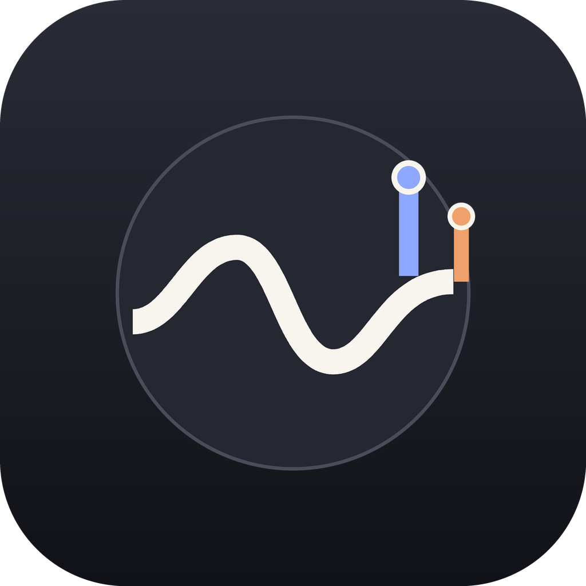
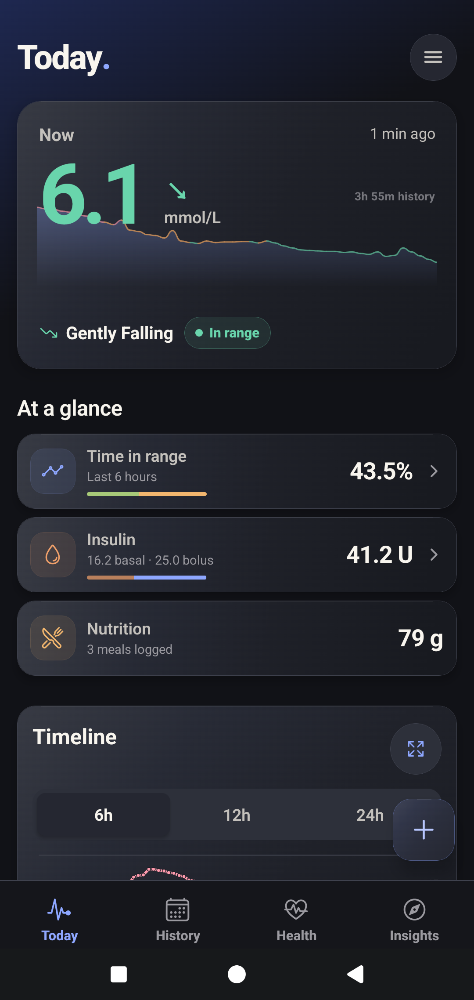
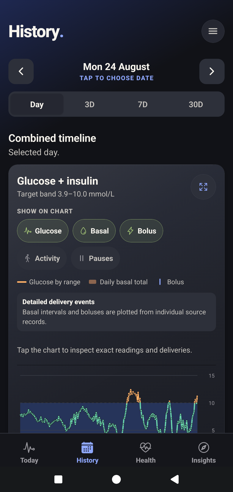
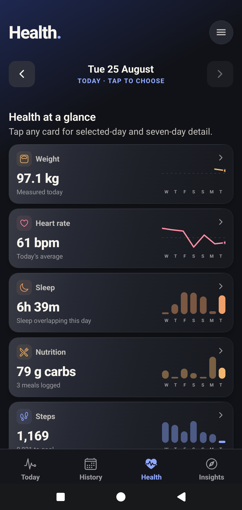
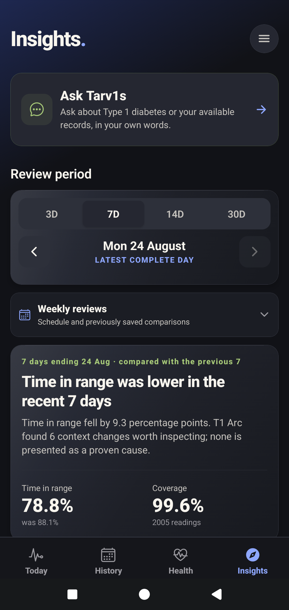
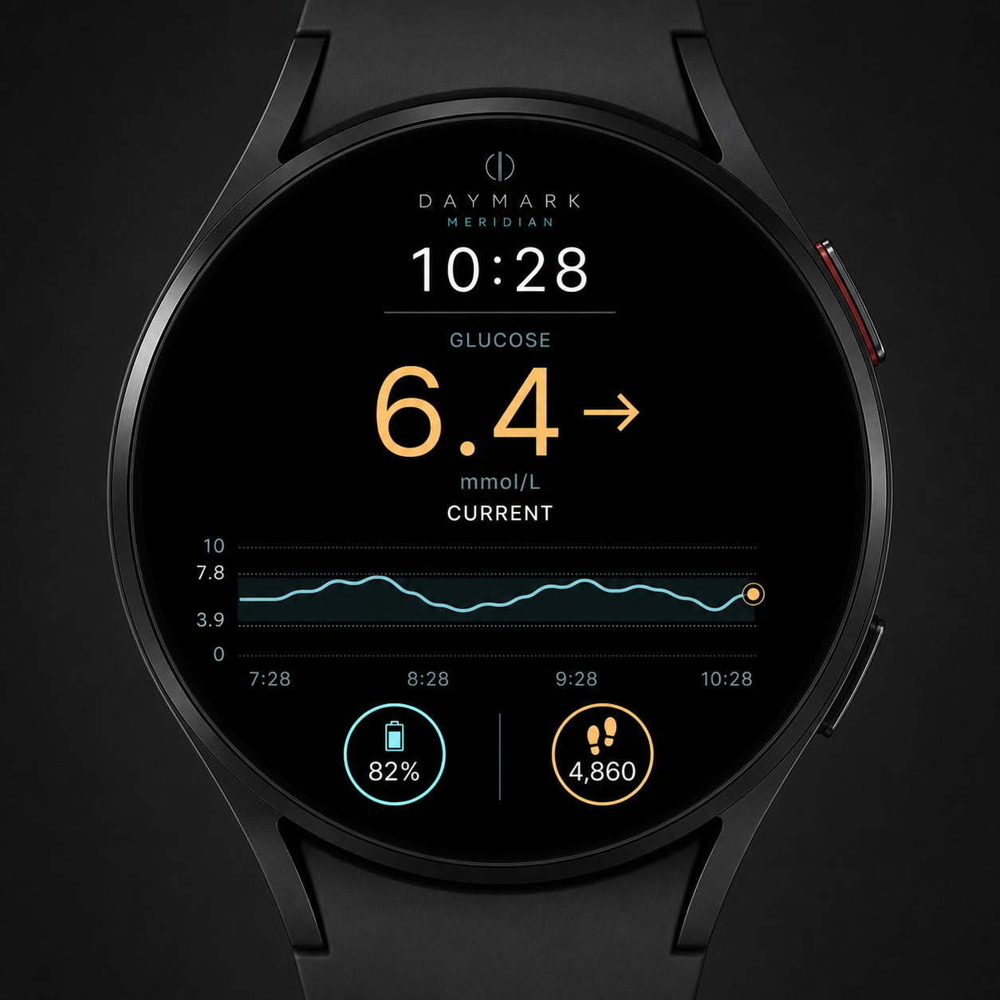

# T1 Arc

<p align="center">
  
</p>

<p align="center"><strong>Your diabetes data, brought together and made easier to understand.</strong></p>

<p align="center">
  
  
  
</p>

T1 Arc is a local-first Android app for bringing glucose, insulin, food, activity and wider health context into one place. It is built to help people inspect their own records, understand what changed and find the evidence behind an observation.

It does not calculate insulin doses, recommend treatment or provide medical advice.

> [!IMPORTANT]
> T1 Arc is under active development. Features, integrations and setup steps may change, and the app is not ready for general distribution yet.

## Why I built it

I have lived with Type 1 diabetes for nearly 20 years. The problem I have kept running into is not a lack of data, but that the data is separated across diabetes apps and health apps, or presented in ways that make the complete picture hard to see.

I wanted one place where I could look at glucose, insulin, meals, activity, sleep and the rest of my health context together. I also wanted an easy way to ask questions about that history without losing the records behind the answer. That is where Tarv1s came from.

My aim is to help people understand their own data more clearly. T1 Arc provides evidence and information when it is available, and says when the record is too incomplete to support a conclusion. It is not intended to tell anyone what to do about their diabetes.

## A look at the app

<table>
  <tr>
    <td align="center" width="25%"><br><strong>Today</strong><br>What is happening now</td>
    <td align="center" width="25%"><br><strong>History</strong><br>Exact records on one timeline</td>
    <td align="center" width="25%"><br><strong>Health</strong><br>The wider context around the day</td>
    <td align="center" width="25%"><br><strong>Insights</strong><br>Changes worth reviewing</td>
  </tr>
</table>

The screenshots above contain the developer's own data, shared with permission.

## What T1 Arc can do

### Bring diabetes records together

- Show the latest glucose reading, direction, freshness and recent history.
- Place glucose, basal insulin, bolus insulin, meals, activity and notes on an inspectable timeline.
- Connect to LibreLinkUp, Nightscout, xDrip+ and Glooko, with support varying by source.
- Preserve source timestamps and individual records rather than replacing them with a single summary.
- Create encrypted local backups without including saved credentials.

### Add the rest of the day

- Read compatible data from Android Health Connect, including activity, heart rate, sleep, steps and weight.
- Let the user choose which Health Connect sources and record types are included.
- Log food by barcode, text search, recent meals, saved meals or a quick carbohydrate entry.
- Use UK CoFID and Open Food Facts data, with support for custom foods and multi-item meals.
- Add manual context such as illness, stress, medication, sensor changes, pod or site changes, travel and hormones.

### Review the evidence

- Compare recent periods while accounting for glucose coverage and missing data.
- Describe associations as things worth inspecting, not as proven causes.
- Link observations back to the time window, calculation and source records used.
- Withhold a conclusion when there is not enough evidence to make a fair comparison.

### Keep useful information close

- Show glucose through an Android widget, persistent notification and optional always-on display.
- Send a signed glucose snapshot to a Wear OS companion.
- Provide a Wear OS Tile, complications and three dedicated watch faces.

<p align="center">
  
</p>

## Ask Tarv1s

Tarv1s is the optional question interface inside T1 Arc. It is designed for questions a person might genuinely want to ask about their own history, for example:

> Was my glucose more stable overnight on days I walked after dinner?

Some exact totals are answered directly on the phone. Broader questions can use a selected evidence packet, then return an answer with the comparison window and supporting records still attached.

Tarv1s uses bring your own key access. The user supplies an OpenAI API key from a project they control, and any API cost is billed directly to that account. The key is kept in Android secure storage. Nothing is sent until the user taps Send, and response storage is disabled in the current OpenAI request.

I have been using GPT-5.6 Luna while building and testing Tarv1s. It has worked very well for this use case, and in my own testing tens of questions have cost only pennies. That is an observation from this project, not a guarantee. Model availability and API pricing can change.

Tarv1s is deliberately limited. It refuses requests for insulin doses, treatment decisions, predictions and medical advice. It also limits the records and conversation context sent with a question.

Read [the privacy model](docs/PRIVACY.md) for the current data flow and safeguards.

## Privacy by design

T1 Arc does not run a central account or health-data server.

- Health history is stored in an encrypted SQLCipher database on the Android device.
- Account credentials and API keys are kept separately in Android secure storage.
- Core totals, comparisons and evidence checks run locally.
- Optional connections are configured by the user and connect directly to the chosen service.
- Encrypted backups exclude credentials, session tokens and API keys.
- Demo data is synthetic and kept separate from personal records.

The project is still evolving, so anyone testing it should read [docs/PRIVACY.md](docs/PRIVACY.md) before adding real accounts or records.

## Run it locally

You will need Node.js 22, JDK 21, Android Studio and an Android device or emulator.

```powershell
git clone https://github.com/gregorgregor25/t1-arc.git
Set-Location t1-arc
npm ci
npm run quality
npx expo run:android
```

T1 Arc uses native Android modules and cannot run in Expo Go. The [full setup guide](docs/SETUP.md) covers data sources, Tarv1s, Wear OS and common build problems.

## Get involved

This project will be better with more people involved, especially people who understand the daily reality of Type 1 diabetes.

- [Report a bug](https://github.com/gregorgregor25/t1-arc/issues/new?template=bug_report.yml)
- [Suggest a change](https://github.com/gregorgregor25/t1-arc/issues/new?template=feature_request.yml)
- Improve a guide or add a test
- Pick up an issue and submit a pull request

Please read [CONTRIBUTING.md](CONTRIBUTING.md) before starting a larger change. Never upload unedited health exports, credentials or screenshots containing information you do not want made public.

## Project documentation

- [Local setup](docs/SETUP.md)
- [Privacy model](docs/PRIVACY.md)
- [Contributing](CONTRIBUTING.md)
- [Security reporting](SECURITY.md)
- [Detailed technical overview](docs/TECHNICAL_OVERVIEW.md)
- [Integration contracts](docs/INTEGRATION_CONTRACTS.md)
- [Tarv1s 50-question evaluation](docs/TARVIS_50_QUESTION_EVAL.md)

## Licence

T1 Arc is source-available under the [PolyForm Noncommercial License 1.0.0](LICENSE). You may inspect, fork, modify and redistribute it for permitted noncommercial purposes. Commercial use is not permitted without separate written permission from the licensor.

Because the licence restricts commercial use, it does not meet the Open Source Initiative definition of open source. The distinction matters, and the repository uses the more accurate term source-available.

## Important notice

T1 Arc is an independent personal project. It is not a medical device, does not provide medical advice and is not a replacement for a continuous glucose monitor, insulin delivery system, clinician or emergency service. Always use the official display and instructions for your medical devices when making treatment decisions.

LibreLinkUp, Nightscout, xDrip+, Glooko, Health Connect, Open Food Facts, OpenAI and other named services belong to their respective owners. Compatibility does not imply endorsement or affiliation.
