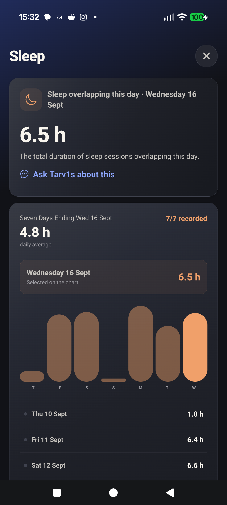

# T1 Arc screenshots

Captured on a Pixel in dark mode on 17 September 2026. The phone views show
the creator's own records, shared with permission. They illustrate the app;
the values and personal food entries are not recommendations or a claim of
complete restaurant coverage. Tap an image for the full-size view.

## Today and History

| Today | Seven-day history |
| --- | --- |
|  |  |

Today combines the current reading with daily context. History supports day,
3-day, 7-day and 30-day views. Imported insulin can arrive later than glucose;
see [source timing](DATA_FRESHNESS.md).

## Tarv1s and Insights

| Tarv1s | Insights |
| --- | --- |
|  |  |

The answer shown is an existing, locally calculated average with its dates and
sensor coverage. Insights compares recorded periods and distinguishes patterns
from proven causes. [How Tarv1s works](USING_T1_ARC.md#tarv1s).

## Food logging

This is an unsaved draft using a food from the creator's personal library.
**Scan**, **Read label**, **Quick carbs** and **Enter food** are directly available.
Search, saved meals, recipes, portions and copying from another day are explained
in the [food guide](FOOD_LOGGING.md). The capture did not add a meal to history.

## Health records

| Daily health context | Sleep detail |
| --- | --- |
|  |  |

The Health view is scrolled to its populated cards. Missing categories stay
missing. Records depend on connected apps, Android permissions and manual entries.

## Sources and regional settings

| Source connections | Regional settings |
| --- | --- |
|  |  |

Country preferences set defaults; each cloud connection still uses its own
supported account region. These choices do not translate the English interface.
See [connections and regions](CONNECTIONS_AND_REGIONS.md) and the
[tested capability boundaries](REGIONAL_CAPABILITY_MATRIX.md).

## Display and privacy

| Display and alerts | Backup and privacy |
| --- | --- |
|  |  |

Glucose starts with green for the in-range colour; users can customise it.
Android retains control over its system permissions. Encrypted backups exclude
passwords and API keys. See [display settings](DISPLAY_AND_ALERTS.md) and
[backup and restore](GETTING_STARTED.md#backups-and-changing-phones).

## Guided watch installation

The [watch guide](WATCH_SETUP.md) has dark-mode phone screenshots for Samsung
and Pixel menu paths, captured with example data on an emulator. The wizard also
covers other supported Wear OS watches and older debugging authorisation.
These illustrations do not mean every physical watch has been tested.
See the [five-face collection](design/WATCH_FACE_COLLECTION.md#the-collection).
