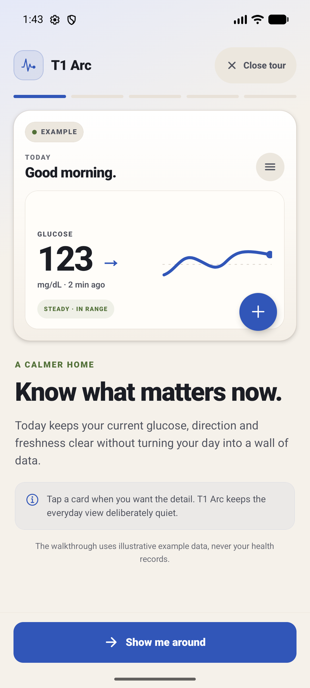
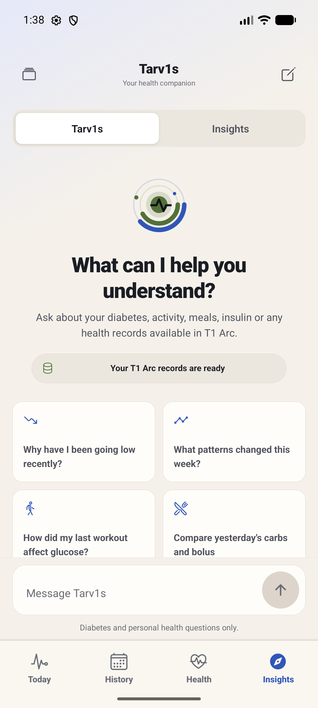
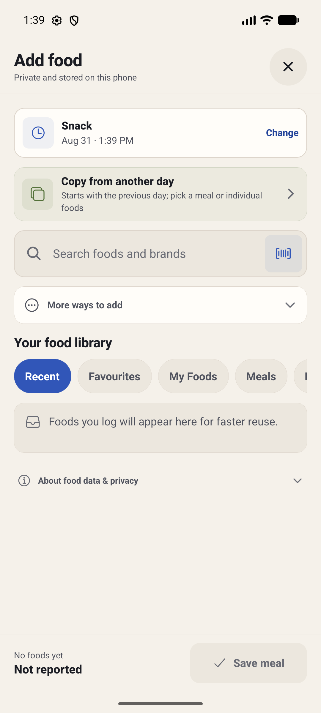
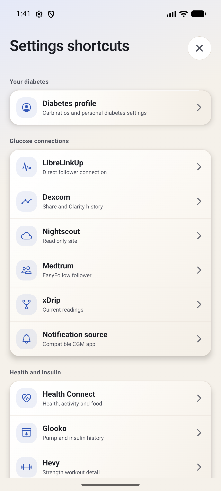
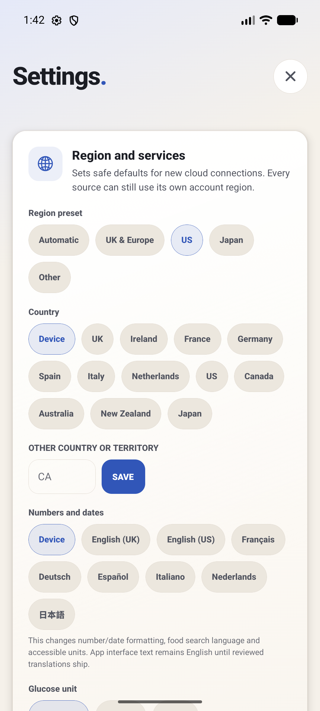
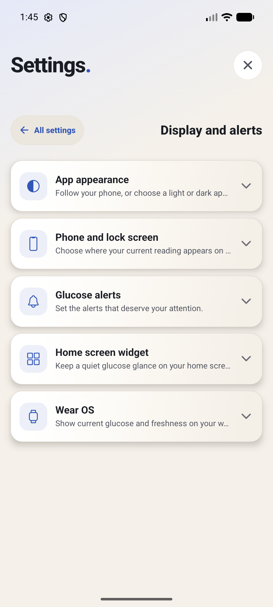
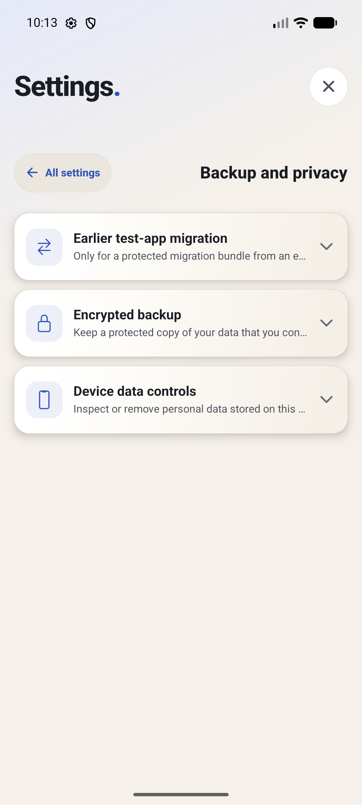

# T1 Arc screenshots

Every image on this page was captured on Android 17 with temporary synthetic
demo data or an empty app state. No personal health records or real provider
accounts are shown.

## First run

The first-run tour explains what the app can and cannot do before asking for
connections or permissions.

## Today and History

| Today | Seven-day history |
| --- | --- |
|  |  |

Today brings the current glucose reading, daily range, insulin, food and health
context together. History lets you move between day, 3-day, 7-day and 30-day
views and inspect the underlying records.

## Insights and Tarv1s

| Insights | Tarv1s |
| --- | --- |
|  |  |

Insights describes measurable changes and keeps the evidence visible. Tarv1s
supports questions about the records on the phone. It is not a dosing tool or a
replacement for a clinician.

## Food logging

Food logging includes recent foods, favourites, saved foods and meals, regional
reference search, Open Food Facts product search, barcode scanning, quick carbs
and copying from another day.

## Sources and regional settings

| Source connections | Regional settings |
| --- | --- |
|  |  |

The regional profile controls safe defaults for formatting, food search and new
connections. Each cloud source can still use its own supported account region.

## Display, backup and health

| Display | Backup and privacy | Health Connect |
| --- | --- | --- |
|  |  |  |

The health screenshot deliberately shows the honest empty state. Imported
records depend on Android Health Connect permissions and data available on the
device.
