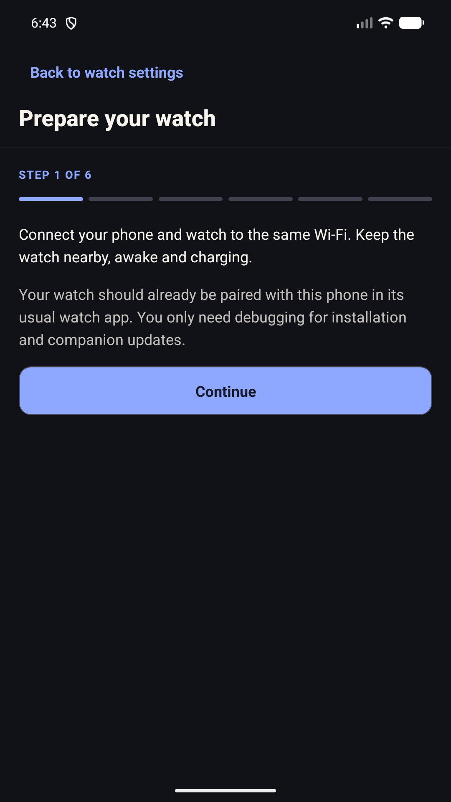
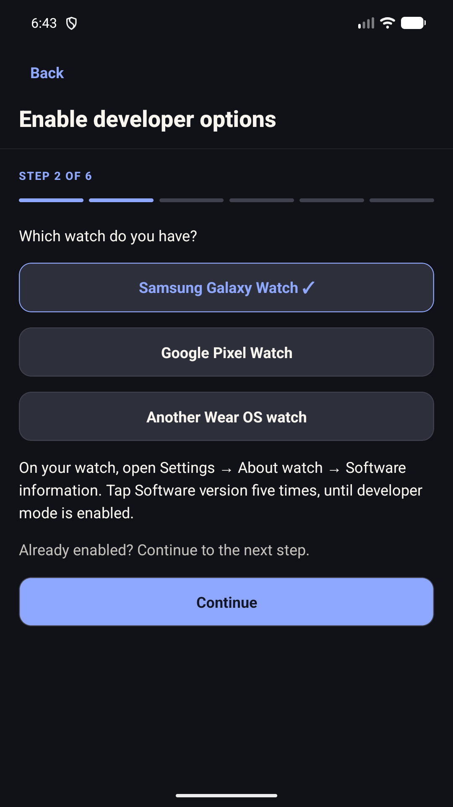
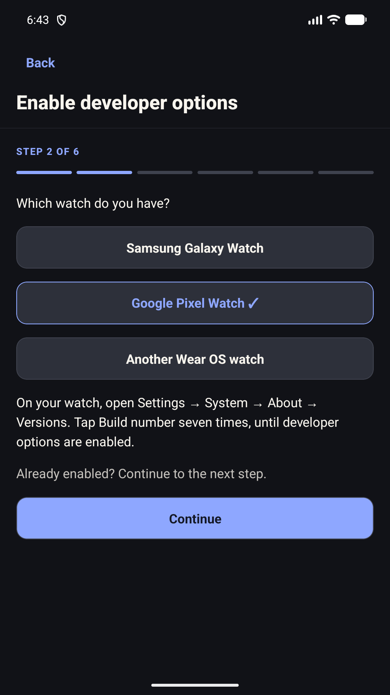

# Set up your watch

## Different watch menus

The phone wizard offers these choices on its developer-options step:

| Watch | On the watch |
| --- | --- |
| Samsung Galaxy Watch running Wear OS | Settings → About watch → Software information → tap Software version five times |
| Google Pixel Watch | Settings → System → About → Versions → tap Build number seven times |
| Another Wear OS watch | Settings → System → About (sometimes About watch) → Build number, possibly under Versions or Software information → tap seven times |

Continue once the watch confirms developer options are enabled. Menu wording
varies with software version. The other-watch route is not a claim that every
model has been physically tested. Samsung watches running Tizen are unsupported.

These paths follow [Samsung's developer instructions](https://developer.samsung.com/sdp/blog/en/2024/04/30/connect-galaxy-watch-to-android-studio-over-wi-fi),
[Google's Pixel Watch version-menu guide](https://support.google.com/googlepixelwatch/answer/13044412)
and [Android's debugging guidance](https://developer.android.com/training/wearables/get-started/debug-wifi).
Checked 17 September 2026. The screenshots below show the actual phone wizard
on an emulator, without provider accounts or health records.

| Prepare | Samsung instructions | Pixel instructions |
| --- | --- | --- |
|  |  |  |

T1 Arc's watch companion shows glucose received from the phone. It does not
connect to your glucose provider on its own. Keep the phone's T1 Arc connection
working, and check the reading's age on the watch.

The independent phone APK can include its matching watch companion. Use the
guided installer when **Set up my watch** appears in Settings. For manual
installation, download the phone and watch APKs from the **same GitHub Release**.

## What your watch supports

| Watch software | Available features |
| --- | --- |
| Wear OS 3 or newer | Companion, glucose complications and tile |
| Wear OS 4 or newer | Five separately installed watch faces |
| Wear OS 6 or newer with Watch Face Push | Choose a bundled face from the phone |

The watch must already be paired to the phone through its manufacturer's app.
Wireless debugging is a separate installation connection. Switch it off after
setup; normal glucose syncing does not need it.

## Install the companion once

Open **Settings → Watch & watch faces → Set up my watch** on your phone.

1. Connect the phone and watch to the same Wi-Fi. Keep the watch awake and charging.
2. Select your watch type and follow the short steps to enable Developer options.
3. Turn on ADB debugging and Wireless debugging on the watch. Allow the network
   prompt, then open **Pair new device**.
4. Select the watch on the phone and enter its six-digit pairing code. If discovery
   fails, the app explains which address and ports to enter. The connection port
   on the main debugging screen differs from the pairing port.
5. Tap **Install on watch** and wait for verification. Existing data is retained.
6. Check the actual glucose reading and its time on the watch, turn debugging off,
   and return to the phone's face chooser.

For updates, use **Install or update watch companion**. Enable debugging again
when asked. Use **This phone is already paired** if the watch still trusts this
phone; otherwise pair with a fresh code. A timed-out installation is checked before
retrying. A signature conflict is reported without removing the existing app.

If the watch only offers **Debug over Wi-Fi**, select that option in the guide and
approve its **Allow debugging** prompt when the phone connects.

## Manual fallback for builds without the guided installer

The following computer-based route remains available for older phone releases
and builds that do not include the installer.

1. Download the companion asset, named `T1-Arc-Wear-vX.Y.Z.apk`, from the same
   release as your phone APK. The version in this filename identifies the
   release set. The companion has its own internal version number.
2. Download and unpack
   [Android Platform Tools](https://developer.android.com/tools/releases/platform-tools).
3. Charge the watch and connect it and the computer to the same trusted Wi-Fi.
4. Enable Developer options and Wireless debugging on the watch. The menus
   vary by manufacturer. Google's
   [watch connection guide](https://developer.android.com/training/wearables/get-started/debugging)
   explains the supported methods.
5. Open **Pair new device** on the watch. In a terminal in Platform Tools, run
   `adb pair WATCH_IP:PAIRING_PORT` and enter the code shown on the watch.
6. Return to the main Wireless debugging screen. Use its connection address
   with `adb connect WATCH_IP:CONNECTION_PORT`. This port is normally different
   from the pairing port.
7. Install the downloaded companion:

    adb -s WATCH_IP:CONNECTION_PORT install -r "PATH_TO_DOWNLOAD/T1-Arc-Wear-vX.Y.Z.apk"

On Windows PowerShell, use `.\adb.exe` in place of `adb` when running it from
the extracted Platform Tools directory. Replace the uppercase placeholders
with the addresses and file location on your own devices.

Open T1 Arc on the watch. In the phone's Settings, open **Watch & watch faces**
(**Display → Wear OS** in older releases) and check the connection. A queued reading means the phone
has handed it to the transport, not that the watch has displayed it. Confirm
the value and its age on the watch itself.

If installation reports a signature conflict, stop. Do not uninstall a
working companion to force an update.

## Choose a face from the phone

On supported Wear OS 6 watches, the companion already contains the five face
files. There is no extra face download.

1. In the phone's **Watch & watch faces** settings, find **Watch faces**.
2. If more than one watch is connected, choose the watch you want to change.
3. Select Meridian, Chronograph, Atelier, Pace or Summit, then tap **Use [name] on watch**.
4. Wait for the confirmed result. Installed and active are different states.
5. For the first face, tap **Open setup on watch** and follow the watch's
   instructions. Android may ask for permission to make the face active.
6. If that permission was declined or the one-time activation attempt was
   already used, touch and hold the current watch face and use the watch's
   **Add watch face** picker instead.

Wear OS 6 gives T1 Arc one managed face slot. Choosing another design replaces
that slot. It does not uninstall other makers' watch faces. Face-specific
customisation may reset when switching designs. Glucose colours and units
continue to follow the phone.

Previews in the phone are watch screenshots with example readings, not your live
glucose. If the phone cannot confirm an operation, check the watch and tap
**Check face status** before trying again.

## Find your style

| Face | What you see |
| --- | --- |
| Meridian | Everyday digital time, glucose and recent history |
| Chronograph | Analogue hands, a central glucose reading and a history register |
| Atelier | A full-size refined dial, faceted hands and an inset glucose window |
| Pace | A bold digital clock, large glucose and a wide history strip |
| Summit | A full-size field-watch dial with Arabic indices and an inset glucose window |

See the [face gallery](design/WATCH_FACE_COLLECTION.md#the-collection). All five
show glucose units and freshness. Tap glucose to open its detailed graph.
The analogue names describe the styling, not a stopwatch feature.

Pace has secondary slots you can customise in the watch's face
editor. Compatible installed providers may offer weather or other information.
The default battery reading is the watch's battery. Steps are recorded by the
watch, not the phone's combined Health Connect total. Atelier, Pace and Summit
also offer dial accents. Those accents do not change glucose range colours.

If you already have Orbit, an update does not remove it without a replacement.
It remains usable, but it is no longer offered in the new collection. Choose one
of the five faces when you are ready. If new designs say **Needs latest watch
companion**, update the companion from the same release as the phone first.

## Older watches and separate face APKs

The glucose companion does not require Watch Face Push. On Wear OS 4 or 5, use
the separate face APKs in the release's **Assets**:

- `T1-Arc-Meridian-vX.Y.Z.apk`
- `T1-Arc-Chronograph-vX.Y.Z.apk`
- `T1-Arc-Atelier-vX.Y.Z.apk`
- `T1-Arc-Pace-vX.Y.Z.apk`
- `T1-Arc-Summit-vX.Y.Z.apk`

Install the chosen face on the watch using the same targeted `adb install -r`
command as above, then select it using the watch's face picker. These separate
packages are not managed by the phone's one-slot chooser.

## Update and troubleshoot

Update the phone and companion from the same release. Install over the
existing packages with `-r`; do not remove them first. Update separately
installed face packages too if that release includes changes to them.

If readings stop:

1. Check that the phone's live source is connected and current.
2. Open the watch companion and compare its reading and age with the phone.
3. Check the phone's **Wear OS** connection status.
4. Confirm the phone and companion came from the same release.
5. If you have two T1 Arc phone apps, check **About T1 Arc** in each. Different
   packages do not share data or watch connections. Force-stopping the app
   connected to the companion stops its updates.

Keep the working apps until the replacement connection has been checked.
Ordinary encrypted backups do not move provider passwords, API keys or Android
permissions between phone packages. See [Backups and changing phones](GETTING_STARTED.md#backups-and-changing-phones).

When reporting a problem, include the phone app's build details, watch model,
Wear OS version and which step failed. Do not post pairing codes, account
details, health exports or personal screenshots.
