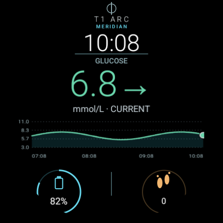
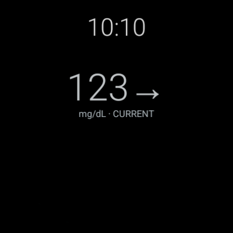
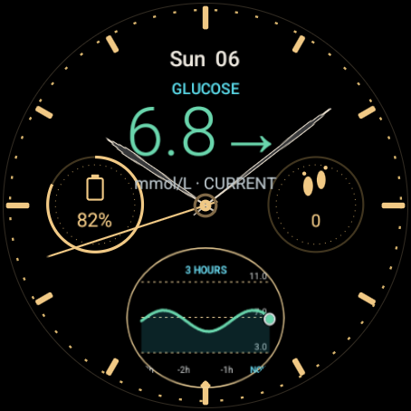
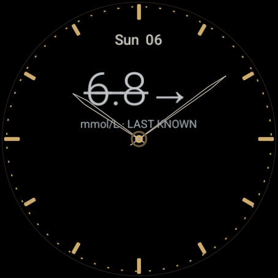
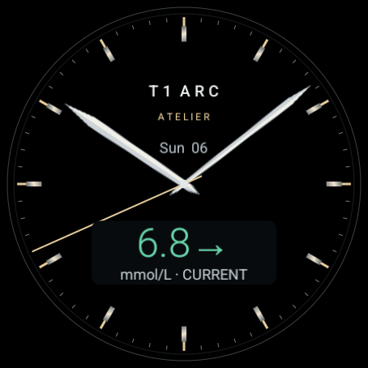
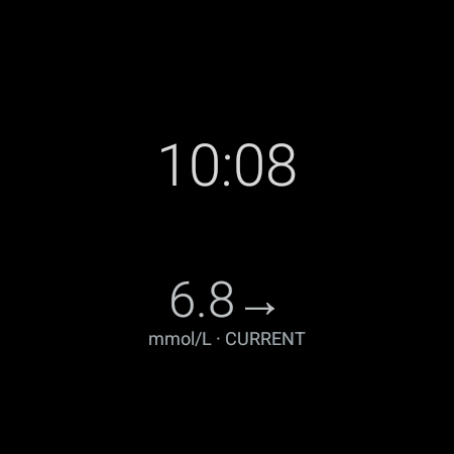
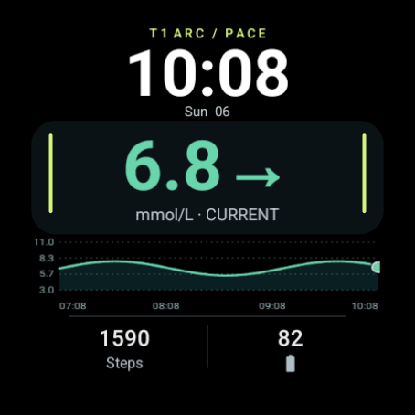
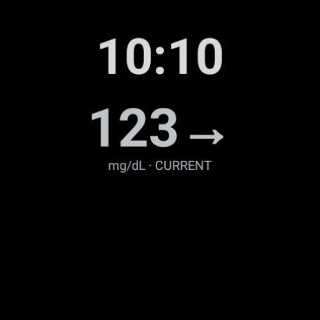
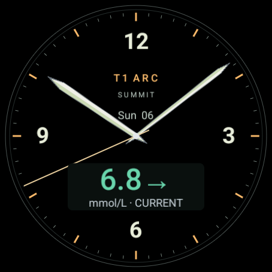
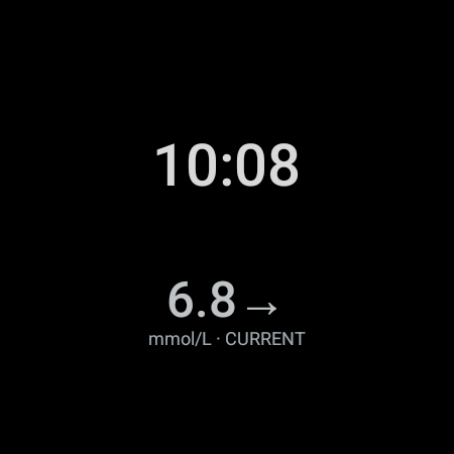

# The T1 Arc watch collection

Choose from five faces: Meridian, Chronograph, Atelier, Pace and Summit.
The images below show real Wear OS emulator renders with synthetic data.
Start in **Settings → Watch & watch faces** on the phone. The guided installer
installs the bundled companion once. Supported Wear OS 6 watches can then choose
any of the five included faces without downloading separate APKs.
[Watch setup](../WATCH_SETUP.md) explains older watches and optional manual downloads.

## The collection

| Face | Style | Emphasis |
| --- | --- | --- |
| Meridian | Everyday digital | Glucose and recent history |
| Chronograph | Analogue instrument | Familiar dial, glucose and history |
| Atelier | Refined analogue | Quiet dial, faceted hands and a clear glucose window |
| Pace | Sports digital | Bold time, large glucose and a wide recent-history strip |
| Summit | Field-watch analogue | Full-size Arabic dial, luminous-style hands and an inset glucose window |

| Face | Active display | Always-on display |
| --- | --- | --- |
| Meridian |  |  |
| Chronograph |  |  |
| Atelier |  |  |
| Pace |  |  |
| Summit |  |  |

The active gallery images above use mmol/L examples. The actual
reading and unit come from the matching phone companion. The phone chooser also
has real screenshots for decimal-point, decimal-comma and mg/dL formats.

[Set up your watch and choose a face](../WATCH_SETUP.md).

Orbit is retired from the new catalog. Updating the companion must not delete a
currently selected face before its replacement installs successfully. The old
Orbit complication service remains only for compatibility with installed copies.

## What belongs on the dial

Time, glucose, direction and freshness take priority. Glucose formatting and
range colours come from the existing companion, including mmol/L or mg/dL.
Decorative accent choices must never change what a glucose colour means.

The watch retains up to six hours of glucose history. Dial graphs use a recent
three-hour window from that feed,
not a new provider connection. Tapping glucose or its graph opens the companion's
detail screen. Missing readings show a waiting state; old readings retain an
explicit stale status. A label printed into the dial must never claim a reading
is current.

Local time and date follow the watch. Battery means the watch battery. Watch
steps come from Wear OS, not the phone's reconciled Health Connect step total.
Optional secondary complication slots can use compatible installed providers,
such as weather or heart rate. Their availability, permissions and update rate
belong to those providers. We do not add a weather subscription, location polling
or a new heart-rate sensor loop to a watch face.

Insulin on board, carbs on board, glucose predictions, treatment instructions
and pump adjustments are not face features. A decorative sports display must
not manufacture physiological metrics or imply that a reading is safe.

## Rendering and power

The faces use Watch Face Format 1 for Wear OS 4 and later. Phone-controlled
installation requires Wear OS 6 and the matching companion. Editable vector
hand artwork is rasterised at build time because WFF hand resources require
bitmap images. Dial markings and typography remain native WFF elements.

Always-on mode removes graph images, secondary data and seconds. It keeps time,
glucose and freshness on a black background. Chronograph retains its hands and
hour markers, using minute-paced vector hand outlines in ambient mode; the other
four use a pared-back digital clock. Android's quality target is
at most 15% illuminated pixels, with 10 MB ambient and 100 MB interactive memory
budgets. Passing XML validation alone does not prove those visual or power
properties; the actual renders and evaluator results need separate evidence.
[Wear OS quality requirements](https://developer.android.com/docs/quality-guidelines/wear-app-quality),
[WFF memory guidance](https://developer.android.com/training/wearables/wff/memory-usage).

Contrast, spacing and restrained information density matter more here than
animated effects. The dial must remain useful at a glance.

## Acceptance checks

- Active and always-on modes on small and large round Wear emulator displays.
- Both glucose units, decimal-comma formatting, low/high colours and missing data.
- Stale readings after the phone stops sending, without a misleading CURRENT label.
- Different hand positions, 12/24-hour clocks, date changes and optional slots.
- All five official WFF validations, native tests, builds and lint.
- Real managed-slot installation, replacement, repeated selections and old Orbit replacement.
- Accurate phone previews and an accessible chooser at large text sizes.
- Synthetic examples only in screenshots. No owner's health data or pairing details.

The guided installation, face chooser and subsequent glucose delivery have been
checked on a Galaxy Watch 8. Other models and older watch versions still need
separate physical checks.
Emulator success cannot establish all-day battery life on a real watch.
